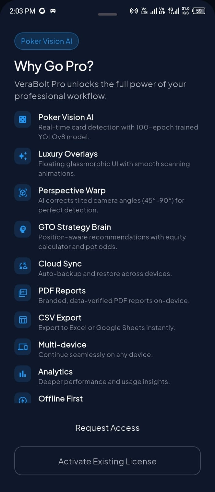
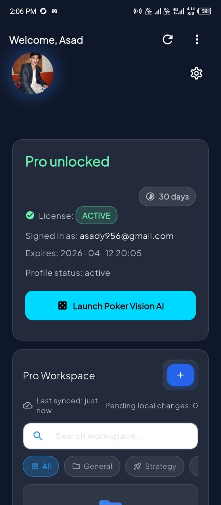

---

# ⚡ VeraBolt: The Ultra-Secure AI Vision & Pro License Ecosystem

**VeraBolt** is a high-performance, resilient SaaS platform designed for professional license management and real-time **Computer Vision (CV)** orchestration. Originally a secure licensing foundation, it has evolved into a "Professional Workstation" featuring an advanced **100% Offline Poker AI Strategy Engine**.

---

   

---

## 🎥 Multimedia Showcases

### 🎰 New: Poker Vision AI Walkthrough

*Watch our 100-epoch YOLOv8 model in action with perspective warping and OCR auto-fill.*

### 🚀 Watch the Full Application Walkthrough

*Click the button above to watch the complete demo video on Google Drive*

----

## 🚩 The Problem vs. 🛡️ The VeraBolt Solution

Traditional professional tools suffer from **Connectivity Dependency** and **Manual Input Friction**.

| The Problem | The VeraBolt Solution |
| --- | --- |
| **Data Loss & Latency** | **Offline-First Core:** Every action is committed to a local Isar database instantly. |
| **Manual Input Errors** | **Phase 3.7 OCR:** Automated "Pot & Stack" reading via on-device ML Kit. |
| **Rigid Vision Systems** | **Phase 3.5 & 3.6:** Perspective warping and USB/OTG External Camera support. |
| **Security Gaps** | **Hardware Fingerprinting:** AES-256 encrypted licenses locked to specific Device IDs. |

---
  
## 🏛️ Project Evolution (Technical Phases)

VeraBolt was built in surgical phases to ensure enterprise-grade stability:

### 👁️ Phase 3: Vision Core & 100-Epoch Intelligence

Implemented a custom-trained **YOLOv8** model (11 hours of deep training) identifying 52 card classes.

* **Result:** High-confidence detection running locally via TFLite.

### 📐 Phase 3.5: Warp Perspective & Luxury Overlay

Added **OpenCV-style Matrix Transformations** to correct tilted camera angles (30°-90°).

* **UI:** Introduced "Glassmorphic" floating labels with suit-based glow effects.

### 🔌 Phase 3.6: The "USB Eye" (External Hardware)

Support for **USB/OTG External Cameras**. Users can plug in a "Snake Camera" or webcam to scan laptop screens while keeping the mobile device as a strategic display.

### 🔢 Phase 3.7: Automated OCR Layer

Integrated **Google ML Kit** for real-time Optical Character Recognition.

* **Feature:** Draggable "ROI" zones that auto-fill Pot and Stack sizes from the table into the engine.

### 🧠 Phase 4: GTO Strategy & Offline Brain

The final integration of **Game Theory Optimal (GTO)** logic.

* **Capabilities:** Real-time Bet/Fold/Raise advice based on hand strength, M-Ratio, and tournament ICM factors—all running 100% offline.

---

## 📱 App Screenshots

### 🔐 Authentication Journey

<table>
  <tr>
    <td align="center">
      <b>Splash Screen</b> 
      
    </td>
    <td align="center">
      <b>Login</b> 
      
    </td>
    <td align="center">
      <b>Sign Up</b> 
      
    </td>
  </tr>
  <tr>
    <td colspan="3" align="center">
       
      ✨ Beautiful, intuitive authentication flow designed for the best user experience ✨
    </td>
  </tr>
</table>

### 👤 Free User Dashboard Journey

**Core Dashboard Features**
<table>
  <tr>
    <td align="center">
      <b>User Dashboard</b> 
      
    </td>
   <td align="center">
  <b>Why Go Pro</b> 
  
</td>
    <td align="center">
      <b>Profile Settings</b> 
      
    </td>
    <td align="center">
      <b>Analytics</b> 
      
    </td>
  </tr>
</table>

**Upgrade & Activation Flow**
<table>
  <tr>
    <td align="center">
      <b>Request Admin Access</b> 
      
    </td>
    <td align="center">
      <b>Waiting for Approval</b> 
      
    </td>
    <td align="center">
      <b>Activation License</b> 
      
    </td>
    <td></td>
  </tr>
  <tr>
    <td colspan="4" align="center">
       
      ✨ Complete free user journey - from dashboard features to pro upgrade ✨
    </td>
  </tr>
</table>

### ⭐ Pro User Dashboard Experience

**Core Pro Features**
<table>
  <tr>
   <td align="center">
  <b>Why Go Pro</b> 
  
</td>
    <td align="center">
      <b>Pro Workspace</b> 
      
    </td>
    <td align="center">
      <b>Item Details</b> 
      
    </td>
  </tr>
</table>

**Advanced Tools**
<table>
  <tr>
    <td align="center">
      <b>Exports</b> 
      
    </td>
    <td align="center">
      <b>Analytics</b> 
      
    </td>
    <td align="center">
      <b>Backup & Restore</b> 
      
    </td>
  </tr>
  <tr>
    <td colspan="3" align="center">
       
      ✨ Unlock the full potential with premium features ✨
    </td>
  </tr>
</table>

### 👑 Admin Dashboard Control Center

**License Management**
<table>
  <tr>
    <td align="center">
      <b>Inventory Control</b> 
      
    </td>
    <td align="center">
      <b>License Status</b> 
      
    </td>
    <td align="center">
      <b>Pending Requests</b> 
      
    </td>
    <td align="center">
      <b>Assign License to Devices</b> 
      
    </td>
  </tr>
</table>

**Bulk Operations & Analytics**
<table>
  <tr>
    <td align="center">
      <b>Generate Bulk License</b> 
      
    </td>
    <td align="center">
      <b>Analytics Overview</b> 
      
    </td>
    <td align="center">
      <b>Advanced Analytics</b> 
      
    </td>
    <td align="center">
      <b>System Operations</b> 
      
    </td>
  </tr>
  <tr>
    <td colspan="4" align="center">
       
      ✨ Full administrative suite for complete platform control ✨
    </td>
  </tr>
</table>

## 🚀 Pro Features at a Glance

### 🏦 Secure Multi-Media Vault

* **Universal Attachments:** Upload and sync PDFs, CSVs, and Images directly within your workspace.
* **Instant Identity:** Personalized profiles with offline-cached avatars and names for zero-latency loading.

### 📊 Advanced Business Intelligence

* **Pro Insights:** Personal productivity heatmaps and storage health charts.
* **Admin Command Center:** Real-time analytics on license distribution, active devices, and renewal velocity using **fl_chart**.

### 📄 Professional Reporting & Safety

* **One-Tap Export:** Generate branded PDF and CSV reports entirely on-device (Privacy-First).
* **Safety Net:** A robust **Restore & Backup** system that recovers accidentally deleted items instantly.

---

## 🛠️ The Tech Stack

* **Frontend:** Flutter (Riverpod for State Management)
* **Database:** Isar (Local) + Supabase (Cloud)
* **Security:** Row Level Security (RLS) & Hardware Identity Mapping
* **Processing:** Client-side Image Compression & PDF Generation

---
## 🛠️ The Advanced Tech Stack

* **Machine Learning:** YOLOv8 (TFLite), Google ML Kit (OCR).
* **Computer Vision:** Perspective Warp Transformations, YUV420 to RGB conversion isolates.
* **Frontend:** Flutter (Riverpod State Management).
* **Security:** AES-256 Encryption, Hardware UUID Mapping, Supabase RLS.
* **Database:** Isar (Local NoSQL), Supabase (PostgreSQL Cloud).

---

## 💎 How It Benefits the Professional

1. **Competitive Edge:** Real-time GTO advice and equity calculations.
2. **Zero Latency:** No cloud API calls; all AI processing happens on-device.
3. **Total Privacy:** Camera frames and hand data never leave the phone.
4. **Hardware Flexibility:** Use built-in cameras or external USB webcams.
5. **Work Anywhere:** From airplanes to underground vaults, your data stays with you.
6. **Total Control:** Manage your license fleet with surgical precision from the Admin panel.
7. **Future-Proof:** Scalable architecture ready to handle thousands of users and millions of sync operations.

---

## 📫 Connect with the Architect

* **Portfolio**: [asad-portfolio-pi.vercel.app](https://asad-portfolio-pi.vercel.app/)
* **Contact**: [asadullah.devop@gmail.com](mailto:asadullah.devop@gmail.com)
* **Status**: `SYSTEMS_OPERATIONAL` 🟢 | `PHASE_4_COMPLETE`

---

